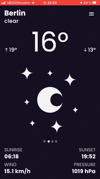
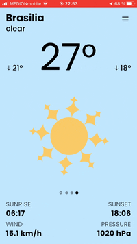
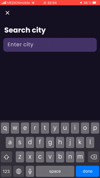
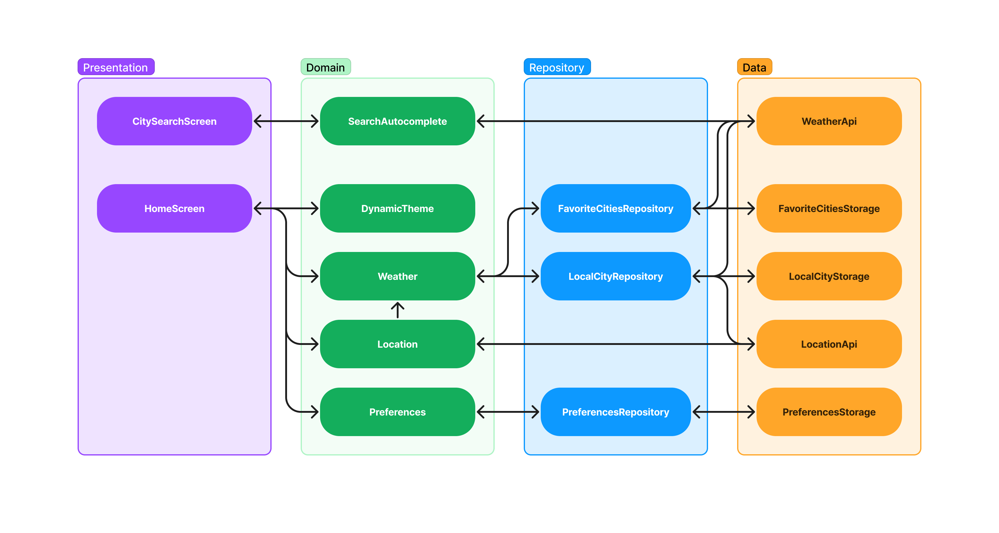

\* Google Play does not open in browsers in Russia. Open the link on an Android device.

# Weather

A stunning Weather app for Android and iOS made with **Flutter** and inspired by a Zuza Wasiak's [work](https://www.behance.net/gallery/142790175/Weather-app-progressive-web-app).

## Challenges

### Extra features

The first challenge that I have faced was adding extra features to the app. The work of Zuza Wasiak involves a predetermined number of favorite cities that cannot be added or removed. Thus, the app would only be used to switch between cities and fetch their weather. Since the main goal of this app is to demonstrate my skills, I have included the following features:

- City search
- Weather in the local city
- Pull to refresh
- Settings
- Dynamic theming

### UI/UX

Adding new features means designing a user interface. The challenge was to design the interface in such a way that matches the design by Zuza Wasiak. I did all the experiments in **Figma**. 

[comment]: <> (The final version of my design can be found [here]&#40;&#41;.)

### Weather animations

This challenge is also not related to Flutter. The weather type animations (in the center of `HomeScreen`) have been recreated with **Rive**. The animations can be found [here](https://editor.rive.app/file/weather_types/230867).

## Development

### Packages

The main packages that I have used in the app are as follows:

`equatable` `freezed` `geolocator` `http` `intl` `json_serializable` `mocktail` `provider` `rive` `timezone`

### Architecture

The app consists of two main screens: `HomeScreen` and `CitySearchScreen`. The app architecture is shown in the diagram below.

> Actually, not all relations are illustrated here. `App` widget has a dependency on `DynamicTheme`. Besides, `SplashScreen` initializes `FavoriteCitiesRepository`, `LocalCityRepository`, `Location` and `Preferences`.

`CitySearchScreen` is a screen where a user can find a city with autocomplete. When the user starts typing one triggers `SearchAutocomplete.onQuery` which in its turn calls `WeatherApi.getCompletion`. Finally, the city selected by the user is returned to `HomeScreen` and added to the favorite cities list.

`HomeScreen` is a screen that shows weather. As one can see from the diagram `HomeScreen` has 4 dependencies:

1. `DynamicTheme`  
   Changes theme when sliding between pages, i.e., cities.
2. `Preferences`  
   Manages measure units (Celsius or Fahrenheit, km/h or m/s, hPa or mmHg) in which weather is displayed.
3. `Location`  
   Tracks the location service status and the location permission. When one of them changes notifies `Weather`.
4. `Weather`  
   Manages local and favorite cities.

### State management

A pair of `Provider` + `ChangeNotifier` is used as state management in the app.

## Improvements

### Minor

- Pull to refresh behavior in `CircularRefreshIndicator` 
  Pulling the screen down in `HomeScreen` can be improved in the following way. When a user pulls the screen down to a certain extent, haptic feedback is triggered and refreshing starts. That is the app does not wait for the user to release the screen.
- Scroll up behavior in `PersistentAppBar`  
  Currently, the bar only shrinks when scrolling down. It would be more natural (at least on iOS) for the large title to expand slightly when scrolling up.
- Reorder the favorite cities list in `HomeDrawer`

### Major

- Localization  
  The app already supports internationalization. Thus, it must be easy to add new languages.
- Authentication  
  Authentication will allow to save a user preferences and favorite cities on a server. Thus, the user easily can change the device and import the data.
- Notifications  
  The idea is to notify a user with a forecast for the day in the morning (or in other fixed time).
- Week forecast  
  At the moment, the app shows weather for the current day. Therefore, the app seems incomplete without week forecasts.
